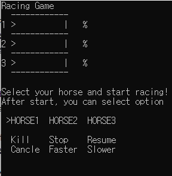
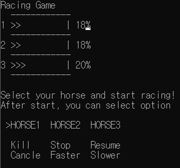
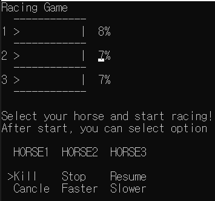
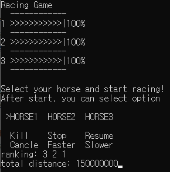
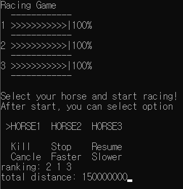
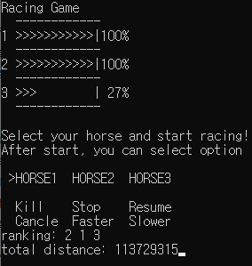

# 쓰레드를 활용한 경마 게임

- 목표
    - 학습한 내용인 스레드를 직접 생성해보고 특징을 확인해보는 것이 목표
    - 스레드의 실행흐름 예측의 어려움을 체험
    - 임계영역을 설정하고 스레드 동기화

- 내용
    - 경마 셋을 각기 다른 스레드로 생성
    - 각 스레드는 자신이 이동한 거리를 나타내는 distance변수가 있고, 전역변수로 선언된 스레드들이 공유하는  total distance 변수가 있다.
    - 전역변수로 선언된 total distance로의 스레드 동시 접근을 막기위하여 mutex를 사용해본다.
    - 말을 빠르거나 느리게, 멈추거나 경기에서 배제하기 위하여 다양한 스레드 상태컨트롤 함수를 사용한다.

- 상세

- 시작
    
    
    
    - 키보드의 화살표키를 눌러 커서를 이동시키고 엔터로 원하는 말을 선택하면 경주가 시작됩니다.

- 진행
    
    
    
    - 시작 시 말의 이동거리가 화살표와 퍼센테이지 형식으로 표시됩니다.

- 상태 컨트롤
    
    
    
    - 경기가 시작되면 원하는 말을 선택하여 선택한 말의 상태를 컨트롤 할 수 있습니다.
    - Kill : 선택된 스레드를 종료하여 말을 경기에서 배제합니다. 순위가 마지막이 됩니다.
    - Stop : 스레드를 일시정지시켜 말을 잠시 멈추게 합니다.
    - Resume : Stop으로 일시정지 시킨 스레드를 다시 진행시켜 말을 다시 달리게 합니다.
    - Cancle : 현재 말 상태 조절을 취소하고 다시 상태 조절할 말을 선택할 수 있습니다.
    - Faster : 선택한 스레드의 우선순위를 높여 말의 속도를 빠르게 합니다.
    - Slower : 선택한 스레드의 우선순위를 낮추어 말의 속도를 느리게 합니다.

- 경기 종료
    
    
    
    
    
    - 모든 말이 끝까지 달려 경기가 종료되면 도착한 순으로 말의 순위를 출력합니다.
    - 전역변수로 스레드들이 공유하던 total distance를 출력하여, 각 말이 달린 거리의 합산을 확인할 수 있습니다.
    - 매번 말의 순위가 달라지는 것으로 스레드의 실행 순서가 보장되지 않음을 확인할 수 있습니다.

- Kill을 사용했을 경우
    
    
    
    - 해당 말의 순위는 마지막이 되고, 해당 말이 마지막까지 달리지 못했기 때문에 자연스럽게 total distance는 최대치에 미치지 못합니다.
    
- 느낀점
    - 가벼운 마음으로 시작했었지만, 프로그램을 만들며 이것저것 조사하다 보니 스레드 상태컨트롤 함수가 있었다는 것처럼 몰랐던 부분을 알게 되었고, 더욱 스레드를 잘 이해할 수 있는 계기가 되었다.
- 아쉬웠던 점
    - 각 스레드가 자신이 가진 출력 함수를 호출하다보니 자신이 출력해야할 부분이 아닌 곳을 침범하여 출력하는 문제가 있었다. 다음에는 출력함수를 담당하는 부분을 만들어 한 곳에 몰아서 처리해야겠다는 생각을 했다.
